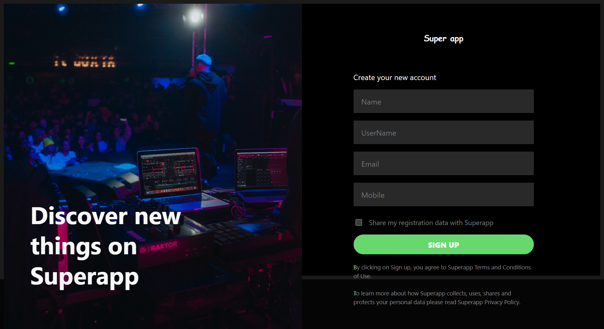
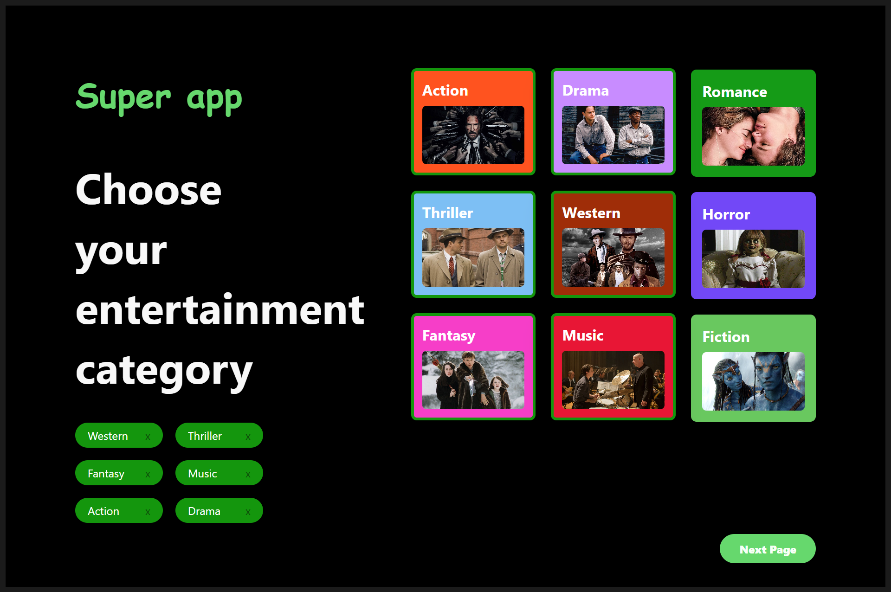
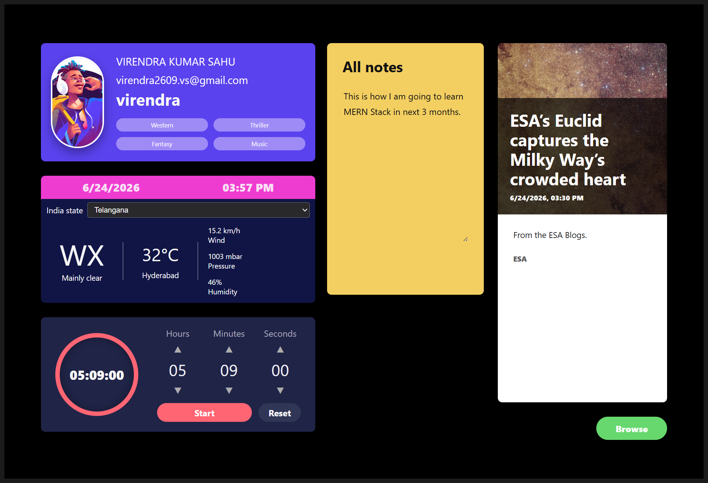
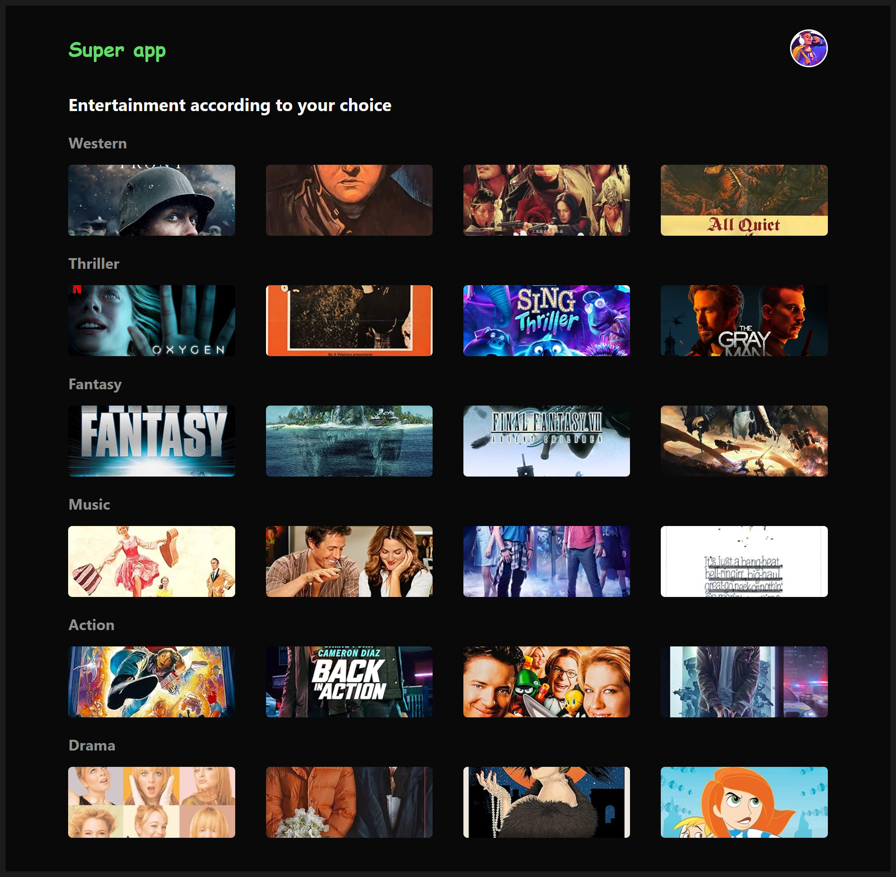
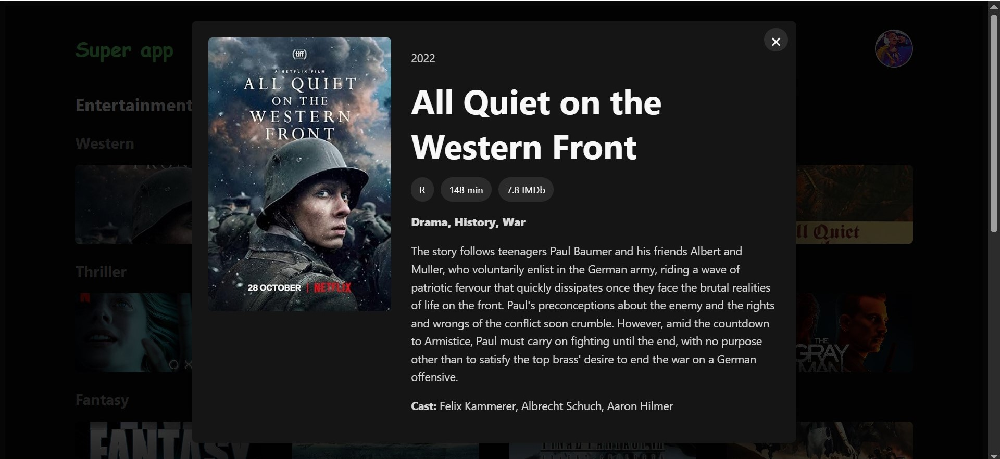

# TheSuperApp

A modern React super-app that combines registration, entertainment preferences, a personalized dashboard, and movie discovery in one responsive web experience.

**Live repository:** [github.com/virendrasahu/TheSuperApp](https://github.com/virendrasahu/TheSuperApp)

---

## Overview

TheSuperApp guides users through a simple onboarding flow:

1. **Register** — create an account with validated form fields
2. **Choose categories** — pick at least 3 entertainment genres
3. **Dashboard** — view profile, weather, notes, timer, and live news
4. **Movies** — browse recommendations based on selected categories

User data and preferences are persisted in the browser using Zustand, so returning users keep their profile, categories, notes, and weather region selection.

---

## Screenshots

### Register Page


### Category Selection


### Dashboard


### Movies


### Movie Details Modal


---

## Features

### Registration
- Split-screen layout with hero image and sign-up form
- Client-side validation for name, username, email, mobile, and consent
- Redirects to category selection after successful sign-up

### Category Selection
- 9 entertainment genres: Action, Drama, Romance, Thriller, Western, Horror, Fantasy, Music, and Fiction
- Minimum 3 categories required to continue
- Selected categories shown as removable tags

### Dashboard
- **Profile card** — user details and selected category chips
- **Weather widget** — live weather for Indian states/UTs via Open-Meteo
- **Notes widget** — editable sticky-note area with clear option
- **Timer widget** — countdown timer with adjustable hours, minutes, and seconds
- **News widget** — auto-rotating articles from Spaceflight News API
- **Browse button** — navigate to the movies page

### Movies
- Movie rows grouped by selected categories
- Fetches data from OMDb API with local fallback posters
- Click any movie to open a detail modal with plot, genre, and metadata

### Route Protection
- `/categories` requires a registered user
- `/dashboard` and `/movies` require registration plus at least 3 categories

---

## Tech Stack

| Layer | Technology |
|-------|------------|
| Framework | React 19 |
| Build tool | Vite 7 |
| Routing | React Router DOM 7 |
| State | Zustand (with `localStorage` persistence) |
| Styling | Custom CSS |
| Linting | ESLint 9 |

---

## APIs Used

| Service | Purpose | Fallback |
|---------|---------|----------|
| [Open-Meteo](https://open-meteo.com/) | Current weather by coordinates | Error state in widget |
| [Spaceflight News API](https://spaceflightnewsapi.net/) | Latest news articles | Local fallback articles |
| [OMDb API](https://www.omdbapi.com/) | Movie search and details | Local movie pool in `assets.js` |

---

## Project Structure

```
TheSuperApp/
├── src/
│   ├── assets/
│   │   ├── optimized/        # Hero, category, and movie images
│   │   └── ProjectSS/        # Project screenshots for README
│   ├── components/           # Reusable UI widgets and cards
│   ├── data/                 # Static assets, categories, India regions
│   ├── pages/                # Register, Categories, Dashboard, Movies
│   ├── routes/               # App routing and route guards
│   ├── services/             # API integrations (weather, news, movies)
│   ├── store/                # Zustand global state
│   ├── App.jsx
│   ├── main.jsx
│   └── styles.css
├── index.html
├── vite.config.js
├── eslint.config.js
└── package.json
```

---

## Getting Started

### Prerequisites

- [Node.js](https://nodejs.org/) 18 or later
- npm (comes with Node.js)

### Installation

```bash
git clone https://github.com/virendrasahu/TheSuperApp.git
cd TheSuperApp
npm install
```

### Environment Variables (Optional)

Create a `.env` file in the project root to use your own OMDb API key:

```env
VITE_OMDB_KEY=your_omdb_api_key
```

If no key is provided, the app uses the public demo key (`thewdb`) and falls back to local movie data when the API is unavailable.

### Run Development Server

```bash
npm run dev
```

Open [http://localhost:5173](http://localhost:5173) in your browser.

### Build for Production

```bash
npm run build
npm run preview
```

### Lint

```bash
npm run lint
```

---

## Available Scripts

| Command | Description |
|---------|-------------|
| `npm run dev` | Start Vite dev server |
| `npm run build` | Build production bundle to `dist/` |
| `npm run preview` | Preview production build locally |
| `npm run lint` | Run ESLint across the project |

---

## User Flow

```
Register (/)  →  Categories (/categories)  →  Dashboard (/dashboard)  →  Movies (/movies)
```

- Unauthenticated users are redirected to `/`
- Users with fewer than 3 categories cannot access dashboard or movies
- Unknown routes redirect to the home page

---

## State Persistence

The following data is saved to `localStorage` under the key `super-app-store`:

- User profile (name, username, email, mobile)
- Selected categories
- Notes content
- Selected weather region

---

## Author

**Virendra Kumar Sahu**

- GitHub: [@virendrasahu](https://github.com/virendrasahu)

---

## License

This project is private and intended for portfolio/assignment use unless otherwise specified by the author.
